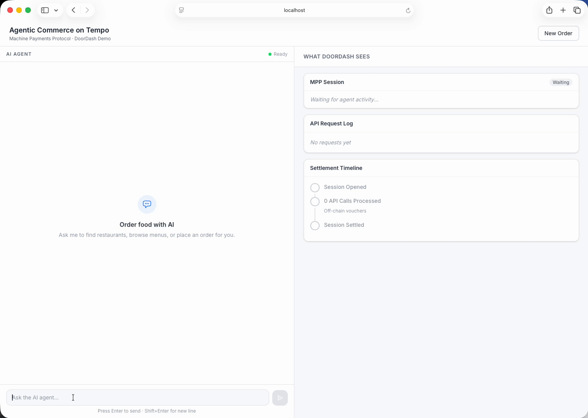

# Agentic Commerce on Tempo -- DoorDash Demo

A full-stack demo exploring how DoorDash could use Tempo's [Machine Payments Protocol (MPP)](https://mpp.dev) to enable AI agent commerce and reduce payment processing costs.



## What This Demonstrates

An AI agent orders food on behalf of a user, paying for DoorDash API access and placing orders using stablecoins on the Tempo blockchain. The demo runs as a split-screen app:

- **Left panel** -- A chat interface where a user asks an AI agent to find and order food
- **Right panel** -- A "What DoorDash Sees" dashboard showing MPP sessions, API request charges, and DoorDash's revenue in real time

The agent browses restaurant menus, compares options, presents a full price breakdown (subtotal, service fee, delivery, tax, tip), and places the order -- all while paying via MPP.

## Why MPP for DoorDash?

**Reducing payment processing costs.** Credit card processing costs DoorDash ~$0.85-1.10 per order (interchange + chargebacks). MPP settles orders in stablecoins for ~$0.01 per session. At scale, that's $20M-$600M+ in annual savings depending on agent adoption.

**Enabling a new order channel.** AI agents are becoming autonomous consumers. MPP is a standardized protocol (co-authored by Stripe and Tempo) for how agents pay for services. DoorDash's existing revenue model (service fees, commissions, delivery fees) works identically for agent orders.

**Natural API abuse prevention.** A $0.01 micropayment per API call makes scraping economically irrational ($10K to scrape 1M items) while being invisible for legitimate agents ($0.03-0.05 per order session). No API keys, rate limiting, or abuse detection infrastructure needed.

## How It Works

```
Agent sends request to DoorDash API
         |
         v
MPP server returns 402 Payment Required
         |
         v
Agent's MPP client automatically signs a stablecoin payment
         |
         v
Agent retries request with payment credential
         |
         v
MPP server verifies payment, returns data with Payment-Receipt header
```

The key integration point is a single middleware call:

```ts
const result = await mppServer.charge({ amount: "0.01" })(request);
if (result.status === 402) return result.challenge;
// ... normal route handler ...
return result.withReceipt(Response.json(data));
```

## Tech Stack

- **Next.js 16** -- Full-stack React framework (App Router)
- **mppx** -- MPP SDK for both server (payment gateway) and client (payment agent)
- **viem** -- Tempo blockchain interaction (wallets, chain config)
- **Anthropic Claude API** -- AI agent with tool-use for restaurant browsing and ordering
- **Tempo Moderato testnet** -- Stablecoin settlement (pathUSD)

## Project Structure

```
src/
  lib/
    mpp-server.ts       # MPP payment gateway (DoorDash side) -- start here
    mpp-client.ts       # MPP payment agent (AI agent side)
    agent.ts            # Claude tool-use orchestration
    tempo.ts            # Tempo wallet & chain config
    session-store.ts    # In-memory state for dashboard visualization
  app/api/
    restaurants/        # MPP-gated restaurant search ($0.01/call)
    menu/[id]/          # MPP-gated menu lookup ($0.01/call)
    orders/             # MPP-gated order placement (dynamic pricing)
    agent/              # AI agent endpoint (streaming NDJSON)
    events/             # SSE for real-time payment dashboard
  components/           # Split-screen UI (ChatPanel, PlatformView)
  data/restaurants.ts   # Mock restaurant catalog (5 restaurants)
```

If you're a developer evaluating MPP integration, start with `src/lib/mpp-server.ts` -- it contains the complete payment gateway setup and detailed talking points on cost savings.

## Getting Started

### Prerequisites

- Node.js 18+
- An [Anthropic API key](https://console.anthropic.com/)

### Setup

```bash
# Install dependencies
npm install

# Copy env template and add your Anthropic API key
cp .env.example .env.local
# Edit .env.local and set ANTHROPIC_API_KEY

# Fund testnet wallets (the default keys are pre-configured Hardhat test accounts)
# Get the agent address and fund it:
curl -X POST https://docs.tempo.xyz/api/faucet \
  -H "Content-Type: application/json" \
  -d '{"address": "0xf39Fd6e51aad88F6F4ce6aB8827279cffFb92266"}'

# Fund the DoorDash recipient wallet:
curl -X POST https://docs.tempo.xyz/api/faucet \
  -H "Content-Type: application/json" \
  -d '{"address": "0x70997970C51812dc3A010C7d01b50e0d17dc79C8"}'

# Start the dev server
npm run dev
```

Open [http://localhost:3000](http://localhost:3000) and try: "I want spicy Thai food under $20"

### Health Check

Visit [http://localhost:3000/api/status](http://localhost:3000/api/status) to verify Tempo RPC, wallet, and Claude API connectivity before running the demo.

## Key Files for MPP Integration

| File | What it shows |
|------|--------------|
| `src/lib/mpp-server.ts` | How to set up an MPP payment gateway with one function call |
| `src/lib/mpp-client.ts` | How an AI agent pays for API access automatically |
| `src/app/api/restaurants/route.ts` | How to gate any API endpoint with `mppServer.charge()` |
| `src/app/api/orders/route.ts` | How to handle dynamic pricing (order totals) with MPP |
| `src/lib/agent.ts` | How Claude tool-use maps to MPP-gated HTTP calls |

## Resources

- [Tempo docs](https://docs.tempo.xyz) -- Developer documentation
- [MPP spec](https://mpp.dev) -- Machine Payments Protocol specification
- [mppx on npm](https://www.npmjs.com/package/mppx) -- MPP SDK
- [Tempo blog](https://tempo.xyz/blog) -- Product announcements and use cases
